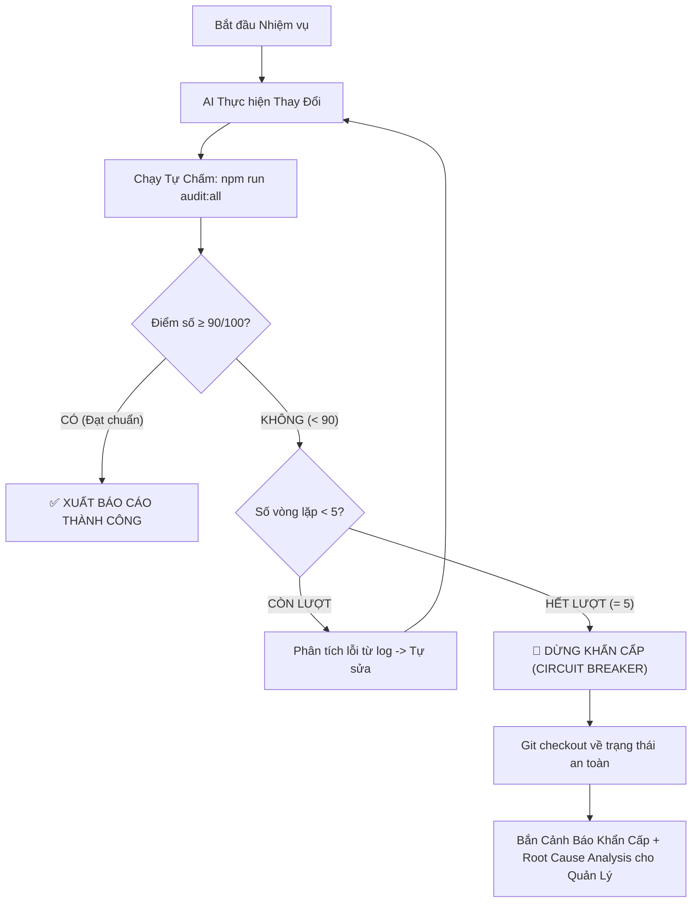

# 🤖 Sổ Tay Thực Chiến: Điều Phối AI Đa Tác Nhân (Multi-Agent System)
### Áp dụng vào dự án Schedule App (OFC) — Từ 1 Tác Nhân Lên 100 Tác Nhân Tự Chủ & An Toàn

> **Nguyên tắc quản trị cốt lõi**: *"Duyệt kết quả cuối, không duyệt thao tác chi tiết — Không tháo phanh an toàn — Đo lường bằng công cụ khách quan, không để AI tự khen."*

---

## 🎯 Vấn Đề Cốt Lõi: "Tầm Nhìn Mù Mờ = Đốt Tiền & Vỡ Hệ Thống"

Để điều phối AI hiệu quả mà không bị rơi vào bẫy "AI tự phán cảm tính" hoặc "chạy vòng lặp đốt token vô hạn", người quản lý cần thiết lập rõ 3 trụ cột:

| Trụ Cột | Định Nghĩa | Ví Dụ Cụ Thể Trong Schedule App |
|---|---|---|
| **1. Trạng Thái Cuối (Goal)** | Mục tiêu có thể đo lường định lượng | "Trang `/admin/schedule` đạt 100% test pass, build < 1s, 0 lỗi console" |
| **2. Tiêu Chí Nghiệm Thu (Eval)** | Công cụ máy tính chấm điểm tự động (Pass/Fail) | `npm run audit:all` đạt ≥ 90/100 điểm (`vitest` 100% pass, `oxlint` 0 warning) |
| **3. Phanh An Toàn (Guardrails)** | Vùng cấm bất biến không cho AI vượt qua | "Không sửa `login` trong `authSlice.js`, không commit `.env`, không bypass `api.js`" |

---

## Cấp 1 — Thực Trạng: 1 Tác Nhân / 1 Nhiệm Vụ

**Cách dùng**: Giao việc đơn lẻ → Chờ AI thao tác → Duyệt từng bước.  
**Hạn chế**: Tắc nghẽn hiệu suất, người quản lý phải làm việc thủ công cùng AI.

### Cách Tối Ưu Ngay:
```
❌ Ra lệnh chung chung: "Sửa giao diện và xem lại mấy cái lỗi."
✅ Ra lệnh theo trạng thái cuối:
   "Khử lỗi query N+1 khi tải lịch nhiều tuần trong scheduleSlice.js.
    Done khi: npm run test pass 100%, getSchedulesByWeeks chỉ gửi đúng 1 HTTP query.
    Không được sửa: authSlice.js (login), không import Supabase trong component."
```

**Các lệnh Slash Command xác thực khả dụng**:
- `/goal` — Giao mục tiêu lớn, AI tự lập kế hoạch và duy trì bám đuổi mục tiêu đến khi xong.
- `/grill-me` — Kích hoạt phỏng vấn phản biện ngược để làm rõ yêu cầu trước khi code.
- `/browser` — Kích hoạt điều khiển trình duyệt kiểm tra thực tế giao diện web.
- `/schedule` — Đặt lịch chạy job nền hoặc hẹn giờ kiểm tra tự động.

> [!NOTE]
> **Lưu ý về `/boost` và `/teamwork-preview`**: Đây là các lệnh thử nghiệm / preview nội bộ của Antigravity runtime (chưa xuất hiện trong tài liệu công khai rộng rãi). Hãy mở Command Palette (`Ctrl+K`, gõ `/`) để kiểm tra trực tiếp khả dụng trên môi trường của bạn trước khi đưa vào SOP tự động. Đối với quy trình chuẩn, hãy ưu tiên dùng `/goal` kết hợp prompt điều phối Subagent.

---

## Cấp 2 — Đột Phá: 10 Tác Nhân Chuyên Biệt Chạy Song Song

### Mô Hình: 1 Tác Nhân Điều Phối (Orchestrator) + 5 Tác Nhân Chuyên Trách

```
                  [NGƯỜI QUẢN LÝ — Chỉ duyệt KẾT QUẢ CUỐI]
                                     |
                     [Tác Nhân Điều Phối (Orchestrator)]
                  /        |         |         |         \
           [Security]  [Quality]  [Test]    [UI/UX]   [Perf & DB]
           (Audit/Read) (Audit/Read) (Write Tests) (Audit/Read) (Audit/Read)
```

> [!TIP]
> **Kỹ thuật chống đè mã nguồn (Write Isolation)**: Trong 5 tác nhân, 4 tác nhân chỉ có quyền **Đọc / Kiểm toán / Xuất báo cáo**. Riêng **Test Writer** là tác nhân duy nhất được phép ghi file mới và được khoanh vùng độc quyền trong thư mục `frontend/src/tests/`. Nhờ vậy, 5 tác nhân có thể chạy song song 100% mà không bao giờ xung đột git hoặc ghi đè code của nhau!

### Bảng 5 Tác Nhân & Tiêu Chí "Done" Đo Bằng Công Cụ (Deterministic Measurements)

Tuyệt đối **không dùng tiêu chí cảm tính** (như "RLS có vẻ đúng" hay "code trông sạch sẽ"). Mọi tiêu chí đều phải được đo bằng lệnh máy tính:

| # | Tác Nhân | Nhiệm Vụ Cụ Thể | Tiêu Chí "Done" Đo Bằng Lệnh (Machine-Verified) |
|---|---|---|---|
| 1 | **Security Auditor** | Quét lỗ hổng bảo mật, RLS và thông tin nhạy cảm | • Chạy test RLS: `npm run test -- rlsSecurity.test.js` ➔ **PASS 100%**.<br>• Quét lộ key bí mật: `grep_search` không có `anon_key` hardcoded trong `src/`.<br>• Không rò rỉ mã NV trên URL public của route `/employee/*`. |
| 2 | **Code Quality** | Quét vi phạm chuẩn mã nguồn & Magic Numbers | • Linter: `npm run lint` (`oxlint`) ➔ **0 error, 0 warning**.<br>• Quét magic numbers: Chạy `scripts/agent_eval_loop.mjs` kiểm tra regex các số `16, 23, 48, 91` hardcoded ngoài `constants.js` ➔ **Đạt 25/25 điểm**. |
| 3 | **Test Writer** | Viết & chạy test nghiệp vụ tự động | • Test Runner: `npm run test` (`vitest run`) ➔ **100% pass (≥ 196 tests)**.<br>• Test coverage > 85% cho các file tính giờ: `shiftHelper.js`, `shiftSuggestionHelper.js`. |
| 4 | **UI & Responsive** | Kiểm tra hiển thị đa thiết bị | • Build bundle: `npm run build` (`vite build`) ➔ **Success**.<br>• Không vỡ giao diện / không có horizontal scrollbar ở cả 2 viewport: Mobile 375px (iPhone SE) và Desktop 1280px. |
| 5 | **Performance & DB** | Tối ưu truy vấn & chống nghẽn DB | • Không có N+1 query: `getSchedulesByWeeks` nạp chu kỳ tháng chỉ trong **1 query duy nhất**.<br>• Không có vòng lặp ghi tuần tự: Đăng ký lịch dùng `updateEmployeeWeeklyShifts` (1 request duy nhất).<br>• File size: Chunks được lazy load hợp lý. |

---

### Phanh An Toàn Bắt Buộc (Guardrails Specification)

```markdown
## ✅ ALLOWED (Tác nhân được phép)
- Đọc toàn bộ mã nguồn trong frontend/src/ và prisma/
- Chạy: npm run test, npm run lint, npm run build, npm run audit:all
- Tạo bài test mới trong: frontend/src/tests/
- Sửa code component khi được giao mục tiêu cụ thể

## ⛔ FORBIDDEN (Ranh giới cấm — Vi phạm là hủy kết quả)
- Tuyệt đối không sửa hàm `login` trong frontend/src/store/slices/authSlice.js
- Tuyệt đối không import trực tiếp `@supabase/supabase-js` trong UI component (bắt buộc qua src/services/api.js)
- Tuyệt đối không commit hoặc sửa các file `.env`
- Tuyệt đối không phá vỡ shape dữ liệu lịch ca: `{ shift, covering_store }`
- Tuyệt đối không thêm backend server Node.js (dự án chạy Serverless client-side + Supabase)
```

> [!IMPORTANT]
> **Về chính sách "Mật khẩu mặc định luôn là 1"**:
> - **Hiện tại (Phase Hướng B — Demo & Staging)**: Giữ nguyên mật khẩu mặc định `1` cho toàn bộ tài khoản nhân viên và admin để phục vụ kiểm thử theo quy định của `AGENTS.md`.
> - **Mốc Chuyển Đổi Lên Production (Security Milestone)**: Trước khi triển khai chính thức cho 100% chuỗi cửa hàng GS25, Security Auditor **bắt buộc phải kích hoạt phiên thẩm định bảo mật**: Chuyển đổi cơ chế xác thực sang Supabase Auth OTP hoặc Single Sign-On (SSO) và yêu cầu đổi mật khẩu ở lần đăng nhập đầu tiên, loại bỏ hoàn toàn mật khẩu mặc định `1`.

---

## Cấp 3 — Quản Trị Tự Động: 100 Tác Nhân & Vòng Lặp Đêm (Autonomous Ops)

### 1. Cơ Chế Tự Chấm Điểm Kèm Bộ Ngắt Mạch Khẩn Cấp (Circuit Breaker)

Để tránh việc AI bị kẹt trong vòng lặp vô hạn và đốt hàng triệu token vô ích khi gặp bug khó, vòng lặp tự chấm **bắt buộc phải có trần số lần lặp cứng (`MAX_ITERATIONS = 5`)**:



**Quy tắc ngắt mạch**:
1. Nếu sau **5 vòng lặp** mà hệ thống vẫn không đạt 90 điểm: Dừng toàn bộ tác nhân ngay lập tức.
2. Tự động phục hồi mã nguồn về commit sạch gần nhất.
3. Xuất báo cáo phân tích nguyên nhân gốc rễ (Root Cause Analysis - RCA) và gắn thẻ `@manager` can thiệp.

---

### 2. Tách Biệt 2 Kênh Thông Báo: Định Kỳ vs Cảnh Báo Khẩn Cấp

Hệ thống điều phối phải tách bạch thành **2 kênh truyền tin riêng biệt**:

```
[Hệ Thống Kiểm Toán Tự Động]
       ├── (Kết quả Bình thường / Xanh) ──> [KÊNH 1: Báo Cáo Định Kỳ - Periodic Digest]
       │                                     └── Gửi tổng hợp vào chat mỗi sáng 8:00 AM
       │
       └── (Phát hiện Nguy Hiểm / Đỏ)   ──> [KÊNH 2: Báo Động Khẩn Cấp - Out-of-Band Alert]
                                             └── Ngắt mạch ngay lập tức + Bắn thông báo khẩn (Telegram / Alert)
```

| Kênh | Khi Nào Kích Hoạt | Kênh Truyền Tải | Mẫu Thông Báo |
|---|---|---|---|
| **Kênh 1: Định Kỳ (Periodic Digest)** | Lịch test sáng 8:00 AM, kiểm tra tuần, changelog | Chat tổng hợp hoặc log file | `"Báo cáo 8:00: Toàn bộ 196 tests PASS, 0 lỗi linter, hệ thống hoạt động bình thường."` |
| **Kênh 2: Khẩn Cấp (Emergency Alert)** | Lộ API key, bypass RLS, fail authentication, hoặc chạm trần 5 vòng lặp | **Bắn tức thì** (High-priority notification / Webhook) | `"🚨 CRITICAL SECURITY ALERT: Phát hiện rò rỉ API secret tại file X dòng Y! Đã kích hoạt Circuit Breaker và phong tỏa mã nguồn."` |

---

## 📋 Bảng Lộ Trình Triển Khai Thực Chiến (Action Plan)

### Bước 1: Vận Hành Ngay Hôm Nay (Cấp 1.5 — Đã Hoàn Thành 100%)
- [x] Thiết lập `GUARDRAILS.md` (Phanh an toàn vùng cấm).
- [x] Thiết lập `EVAL_SPEC.md` (Barem 100 điểm tự chấm).
- [x] Tích hợp script tự động `scripts/agent_eval_loop.mjs` và lệnh `npm run audit:all`.
- [x] Chạy thử nghiệm thành công 3 Subagents kiểm toán song song ➔ Đạt **100/100 điểm**.

### Bước 2: Chuẩn Hóa Vận Hành Tuần Này (Cấp 2)
1. Sử dụng lệnh `/goal` cho các đợt refactor hoặc nâng cấp tính năng lớn.
2. Khi giao việc lớn: Yêu cầu AI chia việc cho các tác nhân con theo nguyên tắc **4 Read-Only Auditors + 1 Test Writer** để chống xung đột ghi đè.
3. Luôn yêu cầu báo cáo kết thúc bằng: `TRẠNG THÁI: PASS/FAIL (Đo bằng lệnh nào, số điểm cụ thể)`.

### Bước 3: Tự Động Hóa Dài Hạn (Cấp 3)
1. Cài đặt cron job qua `/schedule` chạy `npm run audit:all` mỗi sáng 8:00 AM.
2. Cài đặt cơ chế Circuit Breaker (tối đa 5 lần lặp) khi cho AI tự sửa lỗi qua đêm.
3. Khi đưa hệ thống lên Production toàn chuỗi GS25: Kích hoạt mốc đánh giá bảo mật mật khẩu để thay thế mật khẩu mặc định `1` bằng Supabase Auth OTP / SSO.
