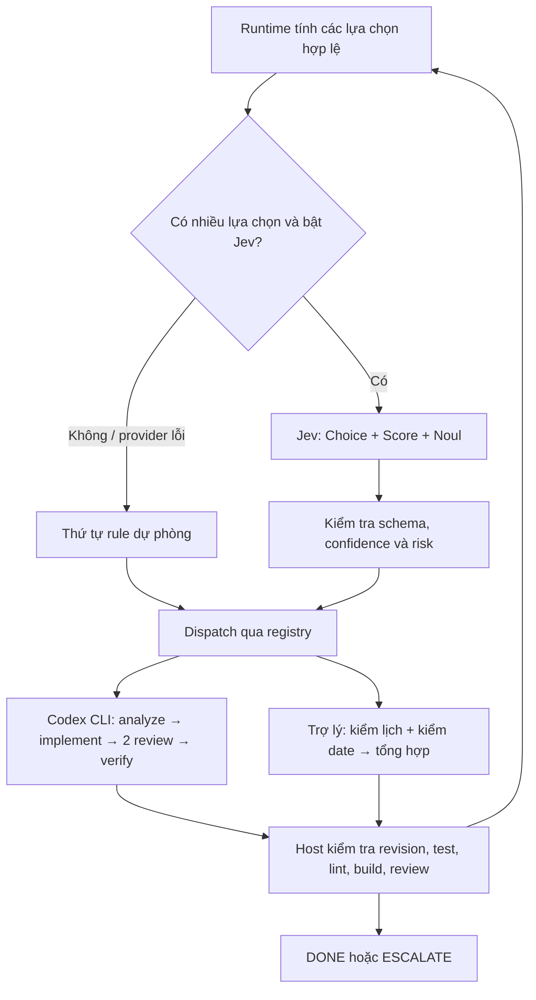

# Jev điều phối Codex CLI và trợ lý GS25

Jev (TypeSafe System One) chọn tác vụ hợp lệ tiếp theo. Runtime giữ quyền thực thi, dependency, ngân sách, snapshot và bằng chứng hoàn thành. Jev không sinh lệnh shell, tự cấp quyền hoặc tự tuyên bố test đã pass.



## Hai runtime

| Runtime | Thực thi | Giới hạn |
|---|---|---|
| Phát triển | Các phiên `codex exec` riêng: phân tích, sửa code, code review, security review; host chạy audit | Writer độc quyền; reader tối đa 3. Review chỉ đọc, writer workspace-write. Không tự commit/push/reset/deploy |
| Trợ lý ứng dụng | Worker JS đọc snapshot Zustand: lịch cá nhân, sức khỏe lịch, kiểm date, tổng hợp | Chỉ đọc, tối đa 2 reader. Lọc user/cửa hàng/kệ được giao; đổi context hoặc hủy request thì bỏ kết quả |

Trong Copilot, nút **Kiểm tra lịch và hạn sử dụng** chạy hai worker rồi tổng hợp. Worker này là tác vụ ứng dụng xác định, không phải hai LLM lớn. Câu hỏi lịch cá nhân đơn giản giữ router cục bộ hiện có; câu hỏi chính sách phức tạp giữ luồng hội thoại hiện có.

## Chạy trên máy với Codex CLI

Yêu cầu: Node có `fetch`, `AbortSignal.any`, Codex CLI đã đăng nhập, dependencies của frontend đã cài. Adapter dùng model trong cấu hình Codex đang có, không tự đổi model. Windows tìm bản npm của Codex trên PATH; có thể đặt `CODEX_CLI_JS` trỏ tới `@openai/codex/bin/codex.js` khi cài ở vị trí khác.

Tại root repo:

```powershell
# Chỉ xem bước tiếp theo, không gọi agent hoặc sửa code
npm.cmd run agents:next

# Demo scheduler, toàn bộ kết quả agent và bằng chứng đều giả lập
npm.cmd run agents:demo

# objective.txt là yêu cầu cụ thể do người dùng viết, không chứa secret
node scripts/jev_agents.mjs --codex --task-file artifacts/objective.txt --review-only

# Chạy phân tích → sửa code → review độc lập → kiểm thử thật
node scripts/jev_agents.mjs --codex --task-file artifacts/objective.txt

# Thêm --live để Jev chọn giữa các tác vụ đang sẵn sàng
node scripts/jev_agents.mjs --codex --task-file artifacts/objective.txt --live
```

`--live` yêu cầu `TYPESAFE_API_KEY` trong môi trường process. Không đặt key trong `VITE_*`, task file hoặc git. Không có `--live` thì vẫn chạy Codex thật nhưng dùng rule để chọn bước. `--demo` luôn giả lập và từ chối kết hợp `--live`/`--run`/`--codex`. `--review-only` không chạy agent sửa code.

Lưu trace JSONL, phản hồi JSON và log kiểm thử trong `artifacts/jev-agents/<run-id>/` đã gitignore. Các log có thể chứa nội dung repo; không công khai chúng tự động. Ctrl+C hủy workflow và dừng cây tiến trình Codex do adapter khởi chạy trên Windows. Mỗi process có timeout 4 phút, runner giới hạn mỗi bước 5 phút; vượt thời gian thì ESCALATE và giữ lại thay đổi để xem xét.

Jev chỉ được gọi khi có nhiều lựa chọn, ví dụ hai reviewer cùng sẵn sàng. Vì vậy `agents:next -- --live` trên plan mới chỉ có `analyze` sẽ dùng rule, không phát sinh request Jev.

## Bằng chứng và hành vi lỗi

- Fingerprint lấy nội dung các file tracked và untracked không bị ignore, loại `.env` và prototype cũ. Kiểm tra lại trước dispatch, sau tác vụ và trước DONE. Writer tạo revision mới sẽ làm mất hiệu lực review/test cũ.
- `DONE` của development cần toàn bộ task bắt buộc thành công, tests/lint/build pass trên cùng revision, hai reviewer Codex khác thread và khác tác giả cùng approve, không có finding. JSON hợp schema hoặc điểm tổng cao không đủ điều kiện.
- Host chạy `scripts/agent_eval_loop.mjs`; mọi gate đều bắt buộc. Lint có warning cũng fail. Kết quả model kể rằng “tests passed” không tạo machine evidence.
- Jev confidence thấp, schema sai hoặc lỗi provider → rule. Risk trên 60/100 hoặc Noul dưới 0.85 → ESCALATE. Đây là ngưỡng thử nghiệm, chưa hiệu chỉnh trên dữ liệu thật.
- Reviewer yêu cầu sửa → ESCALATE ngay trước bước thực thi tiếp theo, bao gồm verify. Bản này giữ kết quả và dừng để xử lý finding; chưa có vòng tự sửa không giám sát hoặc tự phát hành. Bằng chứng điền sẵn trong file state không được runner dùng để báo DONE.
- Đây là điều phối các process CLI do script tạo. Nó không can thiệp vào bộ điều phối nội bộ của phiên Codex đang mở.

Scheduler không phải filesystem sandbox. Adapter Codex áp dụng sandbox CLI; không làm việc đồng thời bằng editor hoặc một writer khác trên cùng repo trong lúc chạy. Fingerprint phát hiện thay đổi, nhưng không cung cấp transaction filesystem. Adapter tùy chỉnh qua `--run --adapter path.mjs` là mã được người dùng tin cậy, phải thực thi đúng quyền và hủy tác vụ khi signal abort.

## Bật Jev cho trợ lý ứng dụng

1. Edge Function `jev-decide` dùng `TYPESAFE_API_KEY` và `JEV_MODEL=jev-latest` ở Supabase secrets.
2. Deploy Edge đã cập nhật. Nó xác thực session và chỉ chấp nhận registry assistant/read, tự tính lại lựa chọn; không nhận task phát triển hoặc lệnh shell từ trình duyệt.
3. Frontend đặt `VITE_JEV_FN_URL` và `VITE_JEV_AGENTS=on`, rồi rebuild. Mặc định off; rule vẫn hoạt động.
4. Kiểm tra log `jev-agent-orchestrator` so với `rule-agent-orchestrator`, tỷ lệ lỗi và thời gian thực tế trước khi mở rộng.

Không có cam kết 100ms, giảm chi phí 70% hay “0% ảo giác” từ kiểm tra schema. Cần đo provider thật và chất lượng quyết định. Triển khai local không đồng nghĩa đã deploy Supabase hoặc bật production.

## Mốc triển khai

Kiểm chứng ngày 25/09/2026: `npm.cmd run audit:all` đạt 553 tests, 7 skipped, lint không warning, build và các gate kiến trúc/quy ước đều pass. Smoke test trình duyệt đã qua desktop 1440px và mobile 390px cho admin/employee; test Copilot tích hợp kiểm tra cả `ALL` và chuỗi phòng ban `A,B`, nghỉ giáp tuần và giờ PT trong tháng.

Đã chạy các phiên Codex CLI thật, nhận finding và sửa: snapshot lỗi thời, phạm vi nhiều cửa hàng ở hai điểm mở drawer, thiếu lịch giáp tuần/tháng, dừng trước verify khi review từ chối, và test xác nhận công phụ thuộc ngày chạy. Lượt review cuối trên bản sửa dừng do tài khoản chạm quota (log báo thử lại sau 13:03 ngày 25/09), nên **chưa có hai approval CLI cho bản cuối và chưa có lượt end-to-end DONE thật**. Rule fallback, demo và bộ test không thay thế approval đó. Trace giữ cục bộ trong `artifacts/jev-agents/`.

| Mốc | Trạng thái |
|---|---|
| Core arbiter, dependency, budget, revision và cancellation | Đã triển khai, có regression test |
| Trợ lý nhiều tác vụ và Edge registry | Đã tích hợp, mặc định rule |
| Adapter Codex CLI và bằng chứng review/test thật | Đã chạy CLI thật; finding đã sửa; review bản cuối chờ quota |
| Jev provider thật và đo độ trễ/chất lượng | Chờ cấu hình `TYPESAFE_API_KEY` |
| Deploy Edge và bật flag production | Chưa thực hiện |
| Tự sửa theo finding, worktree riêng từng writer, bộ dữ liệu hiệu chỉnh | Chưa triển khai |

Contract provider theo [TypeSafe API](https://docs.typesafe.ai/api). Adapter dùng stdin, JSONL và schema output theo [Codex non-interactive mode](https://learn.chatgpt.com/docs/non-interactive-mode); các cờ đã đối chiếu `codex exec --help` trên máy này.
