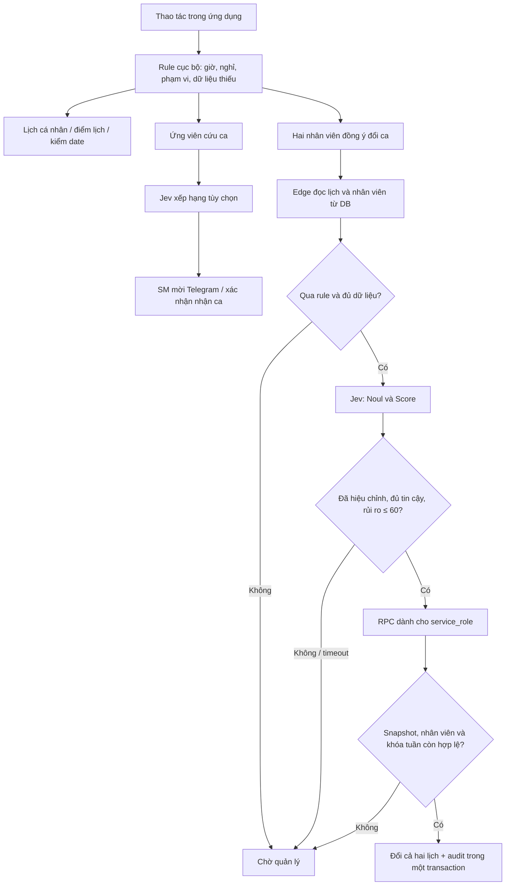

# Jev / bộ quyết định nhanh — tiến độ và triển khai

Bản ổn định trước thay đổi này đã commit tại `c20d94c`. Không sửa prototype `schedule-app/`, không đổi cơ chế đăng nhập hoặc mật khẩu mặc định.

## Phạm vi đã triển khai

| Luồng | Có trong bản này | Điều kiện hoạt động |
|---|---|---|
| Đổi ca | Sơ duyệt có lý do/rủi ro; sau đồng thuận gọi Edge đọc dữ liệu thật; tự duyệt bằng RPC nguyên tử | Jev và tự duyệt mặc định tắt. Cần migration, secrets và hiệu chỉnh theo cửa hàng |
| Cứu ca | Top 2 ứng viên, bao gồm OFF; kiểm tra giờ/nghỉ; xếp hạng Jev tùy chọn; mời Telegram; xác nhận trước khi ghi ca | Rule chạy ngay. Jev/Telegram cần cấu hình riêng; lời mời gửi vào nhóm đã cấu hình, chưa hỗ trợ DM cá nhân |
| Sức khỏe lịch | Điểm cân bằng cuối tuần, rủi ro lịch dày, ca đêm liên tiếp, thiếu định mức, tỷ lệ đã xếp | Tính cục bộ; không gọi Jev. Chưa có lịch ngày lễ, kỹ năng hoặc xác suất nhận ca thực tế để suy luận thêm |
| Kiểm date | Top 5 việc cần xem; giờ HSD cho hai lô, tốc độ bán, cửa sổ giảm giá/trả NCC; bốn action có cấu trúc | Tính cục bộ; không gọi Jev. Đề xuất, chưa tự thao tác kho/giá. Thiếu giờ hôm nay → cần bổ sung; ngày HSD đã qua → tách lô quá hạn |
| Copilot | Câu hỏi lịch hôm nay/ngày mai, tổng giờ tuần này đọc Zustand trước nhánh LLM, theo lịch Việt Nam; phân biệt OFF/chưa xếp | Router cục bộ theo các mẫu đã kiểm thử. Câu hỏi ngoài mẫu vẫn vào bộ hội thoại hiện có; chưa dùng Jev phân loại câu tự do |

Đây là bản kết hợp rule và Jev, không phải năm mô hình đã được huấn luyện. Không suy ra kinh nghiệm thu ngân nếu chưa có dữ liệu kỹ năng. Không coi 48 giờ của FT là một trần pháp lý mới: vượt định mức sẽ chuyển quản lý xem xét. Ngưỡng nghỉ 11 giờ dùng cho sơ duyệt bảo thủ, thống nhất với cảnh báo nghỉ giữa ca hiện có.

## Hợp đồng và an toàn dữ liệu

API chính thức: [TypeSafe System One](https://docs.typesafe.ai/api). Đã sửa endpoint thành `/v1/systemone`; Noul là số 0–1; Score là vị trí trên thang tiêu chí, được quy đổi về 0–100. Schema chỉ kiểm soát hình dạng đầu ra, không chứng minh phán đoán đúng.

`services/api/aiDecisions.js` là điểm gọi từ ứng dụng. Edge giữ template câu hỏi, không nhận câu hỏi tùy ý từ client. Đổi ca lấy lại dữ liệu DB; chỉ alias, loại nhân viên và kết quả rule được gửi tới Jev. Xếp hạng chỉ gửi alias và thuộc tính cần thiết, không gửi tên/mã nhân viên. Timeout provider 1,8 giây, client 2,5 giây; có circuit breaker và giới hạn theo người dùng trên từng instance (chưa phải rate limit phân tán).

Hàm `jev_approve_swap` chỉ cấp quyền cho `service_role`. Trước khi ghi, so sánh cả version **và nội dung** các lịch tháng/giáp tuần, cùng dữ liệu nhân viên. Đoạn commit khóa bảng lịch ngắn để bảo vệ cả hàng trước đó chưa tồn tại; không giữ khóa khi gọi mạng/model. Cần đo tranh chấp khóa trong staging nếu tải lớn. Audit commit cùng transaction; lỗi lần ghi thứ hai không để lại lịch đổi dở.

Gợi ý trên browser không có quyền tự duyệt. Tự duyệt hiện được kích hoạt khi ứng dụng hoàn tất bước đồng ý; chưa có worker/webhook chạy lại nếu browser đóng ngay sau khi lưu đồng thuận. Trường hợp đó đơn tiếp tục chờ quản lý. Không tự retry một giao dịch đã hết thời gian ở client; realtime/tải lại phản ánh kết quả server.

Đã sửa thêm: nhân viên được mời có thể từ chối, thông báo thành công chờ API, thiếu ô lịch không đổi thành OFF, chi viện giữ cửa hàng gốc, lịch sử Copilot tách theo tài khoản/cửa hàng, Telegram kiểm tra JWT thật, lưu hàng kệ dùng RPC nguyên tử và bỏ fallback xóa/chèn dễ mất dữ liệu.

## Kiểm chứng tại máy phát triển

- `npm.cmd run test`: 485 passed, 7 skipped (các probe tích hợp ngoài môi trường).
- `npm.cmd run lint`: không cảnh báo; `npm.cmd run build`: thành công, còn cảnh báo chunk lớn hiện có.
- `python scripts/test_jev_db.py` và `python scripts/test_jev_db.py --legacy`: quyền, khóa tuần, snapshot stale, cập nhật trực tiếp không tăng version, rollback, audit một lần, lưu HSD theo giờ và quyền kệ.
- `node scripts/check_jev_ui.mjs`: desktop 1440×1000/mobile 390×844, admin/employee, lịch/timesheet/kệ; OFF cần xác nhận; câu hỏi cá nhân bỏ qua LLM dù đã cấu hình key giả. Chặn toàn bộ mạng ngoài localhost; không gửi Telegram thật.
- `node scripts/benchmark_decisions.mjs`: 30 nhân viên, 300 mẫu. Một lần chạy p95 tìm người **13,738 ms**, điểm lịch **11,735 ms**. Đây là rule cục bộ trên máy phát triển, không phải SLA của thiết bị người dùng hay Jev.

Chưa gọi Jev thật, chưa đo tỷ lệ tự duyệt/chi phí/token, chưa deploy migration hoặc Edge lên Supabase thật. Mốc 100–150 ms, 80% tự duyệt và 70% tiết kiệm vẫn là mục tiêu.

## Timeline tiếp theo (ước lượng)

| Mốc | Thời gian dự kiến | Kết quả cần đạt |
|---|---:|---|
| Code và kiểm thử local | Đã hoàn thành phần trên | Bản có thể review; chức năng cục bộ chạy khi Jev tắt |
| Staging: migration + Edge + cấu hình | 45–90 phút sau khi có môi trường | Login thật, quyền thật, lưu HSD và consent đổi ca chạy đầy đủ |
| Đo Jev và hiệu chỉnh | 1–2 ngày làm việc sau khi có dữ liệu gán nhãn | Tập giữ riêng, đủ ca nguy hiểm/không đồng ý, p50/p95 và chi phí; chưa tự bật bằng báo cáo tổng accuracy |
| UAT với SM/nhân viên | 0,5–1 ngày | Đổi ca giáp tuần/tháng, OFF, khóa tuần, chi viện, lỗi mạng, Telegram vào nhóm kiểm thử |
| Pilot một cửa hàng | 2–3 ngày theo dõi | Bật riêng từng flag; tự duyệt chỉ sau khi đạt ngưỡng đã duyệt |

Các bước cần dữ liệu/môi trường có thể chạy song song; đây không phải cam kết thời gian khi chưa có key/tập nhãn/staging.

## Cấu hình khi triển khai staging

1. Áp dụng các migration theo thứ tự; migration mới: `20260924000000_jev_decisions.sql`. Deploy frontend mới sau migration vì lưu kệ yêu cầu RPC có các cột HSD giờ mới.
2. Deploy `jev-decide` và `telegram-notify` bằng quy trình Supabase hiện có. Không đưa `TYPESAFE_API_KEY` hoặc bot token vào biến `VITE_`.
3. Edge secrets: `TYPESAFE_API_KEY`, `JEV_MODEL` (mặc định `jev-latest`), `JEV_AUTO_APPROVE=off`. Supabase cấp các biến URL/anon/service role trong môi trường Edge.
4. Frontend: đặt `VITE_JEV_FN_URL`; bật `VITE_JEV_UC2=on` để xếp hạng, `VITE_JEV_SWAPS=on` để gọi sơ duyệt server; rebuild. Rule cục bộ vẫn chạy nếu cả hai flag tắt.
5. Telegram: bot/chat ID ở Edge; frontend dùng `VITE_TELEGRAM_PROXY_URL`. Kiểm tra lời mời ở nhóm staging bằng tài khoản đã đăng nhập; không tự gửi trong script kiểm thử.
6. Script `jev_calibration.mjs` dùng chung template server, validate câu trả lời và báo p95. Có thể chạy task `shift_swap_assessment`, field `auto_approved`, type `noul` hoặc field `risk_level`, type `score`; nhãn Score dùng chỉ số bậc gốc 0–4. Dữ liệu state cần ẩn danh và đúng dạng server. Không có dữ liệu nhãn thật trong repo.
7. Sau hiệu chỉnh, người vận hành ghi một hàng `jev_auto_approval_settings` cho cửa hàng: `enabled`, `min_noul`, `min_confidence` (cả hai từ 0,9 đến 1), `model`, `calibrated_at`. Không có ngưỡng mặc định được coi là đã hiệu chỉnh. Sau đó mới bật `JEV_AUTO_APPROVE=on` ở Edge.

Rollback nhanh: đặt `JEV_AUTO_APPROVE=off` và/hoặc `enabled=false` ở cấu hình cửa hàng; đơn tiếp theo chờ SM. Để ngừng mọi gọi Jev từ UI, tắt flag và rebuild. Giữ migration để không mất dữ liệu HSD mới hoặc audit; không xóa bảng để rollback.
